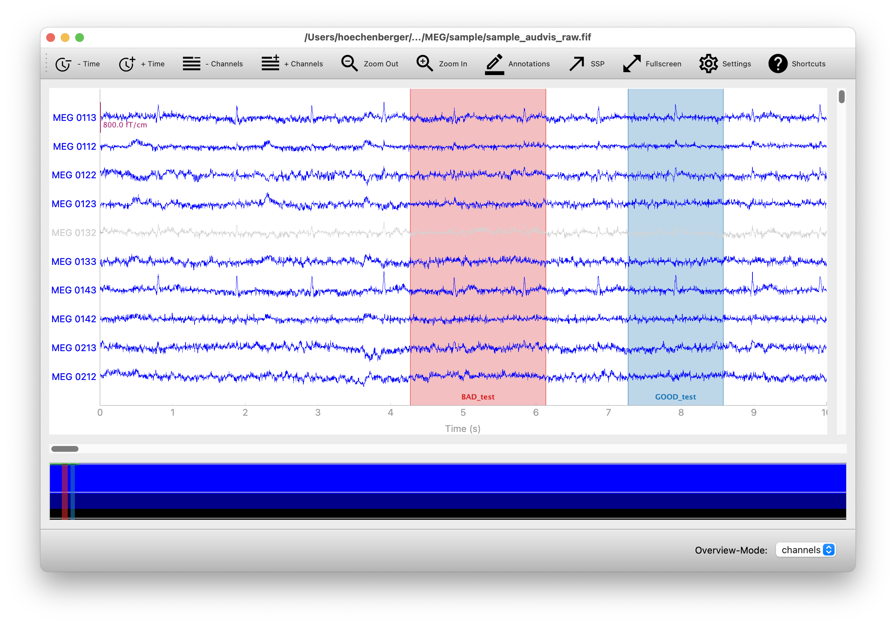

# mne-qt-browser

## A new backend based on pyqtgraph for the 2D-Data-Browser in MNE-Python.



This repository hosts the code for an alternative backend for plotting 2D-Data with 
[MNE-Python](https://github.com/mne-tools/mne-python).

The backend is based on [pyqtgraph](https://github.com/pyqtgraph/pyqtgraph) 
which uses Qt's [Graphics View Framework](https://doc.qt.io/qt-5/graphicsview.html)
for the plotting.
Development started as a [2021's Google Summer of Code Project](https://github.com/marsipu/gsoc2021).
Currently, only `Raw.plot()` is supported. For the future support for Epochs
and ICA-Sources is planned.

## Installation
Install **full MNE-Python** with the instructions provided [here](https://mne.tools/stable/install/mne_python.html#d-plotting-and-source-analysis) or install **minimal MNE-Python** with
### pip
```
pip install mne matplotlib mne-qt-browser
```
or
### conda
```
conda install -c conda-forge mne-base matplotlib mne-qt-browser
```

## Usage

In the following example, we'll read M/EEG data from the MNE `sample` dataset
and plot it using the `mne-qt-browser`.

```python
from pathlib import Path
import mne

sample_dir = mne.datasets.sample.data_path()
raw_path = Path(sample_dir) / 'MEG' / 'sample' / 'sample_audvis_raw.fif'
raw = mne.io.read_raw(raw_path)

mne.viz.set_browser_backend('pyqtgraph')  # Enable mne-qt-browser backend
raw.plot(block=True)
```

If the plot is not showing, search for solutions in the
[troubleshooting](#troubleshooting) section below.

This will use the `mne-qt-browser` for the current Python session. If you
want to make this change permanent so you don't have to use the
`set_browser_backend()` each time after restarting Python, run the following
line to modify your MNE configuration file:

```python
mne.set_config('MNE_BROWSER_BACKEND', 'pyqtgraph')
```

## Troubleshooting

### Running from a script

If you are running a script containing `raw.plot()` like

```console
python example_script.py
```

the plot will not stay open when the script is done. 

To solve this either change `raw.plot()` to `raw.plot(block=True)` or run the script with the interactive flag

```console
python -i example_script.py
```

### IPython

If the integration of the Qt event loop is not activated for IPython, a plot with `raw.plot()` will freeze.
Do avoid that either change `raw.plot()` to `raw.plot(block=True)` or activate the integration of the event loop with

```python
%gui qt5
```

### Report Bugs & Feature Requests

Please report bugs and feature requests in the [issues](https://github.com/mne-tools/mne-qt-browser/issues) of this repository.

### Development and testing

You can run a benchmark locally with:

```console
pytest -m benchmark mne_qt_browser
```

To run tests, clone mne-python, and then run the PyQtGraph tests with e.g.:

```console
pytest -m pgtest ../mne-python/mne/viz/tests
```

If you do not have OpenGL installed, this will currently raise errors, and
you'll need to add this line to `mne/conftest.py` after the `error::` line:

```raw
    ignore:.*PyOpenGL was not found.*:RuntimeWarning
```
